```{r setup, include = F, echo = F}
htmltools::tagList(rmarkdown::html_dependency_font_awesome())
```

*This tutorial comprehends the BFAST Explorer v0.0.1. Notice that if you are using a newer version, some features might be different.*

***

## Description

**BFAST Explorer** is a [Shiny](https://shiny.rstudio.com/) app, developed using R and Python, designed for the analysis of *Landsat Surface Reflectance* time series pixel data.

Three change detection algorithms - **bfastmonitor**, **bfast01** and **bfast** - are used in order to investigate temporal changes in trend and seasonal components, via breakpoint detection.

If you encounter any bugs, please send a message to almeida.xan@gmail.com, or create an issue on the [GitHub page](https://github.com/almeidaxan/bfast-explorer/).

## Tutorial

Albeit very simple, please follow this short usage guide to learn how to
properly use the tool.

### Map Tab <i class="fa fa-map-marker"></i>

This is the starting tab, which we first see when we run the tool. The 
tab is composed of an interactive map (rendered using Google Maps engine)
and a navigation toolbar. Feel free to zoom and pan the map.

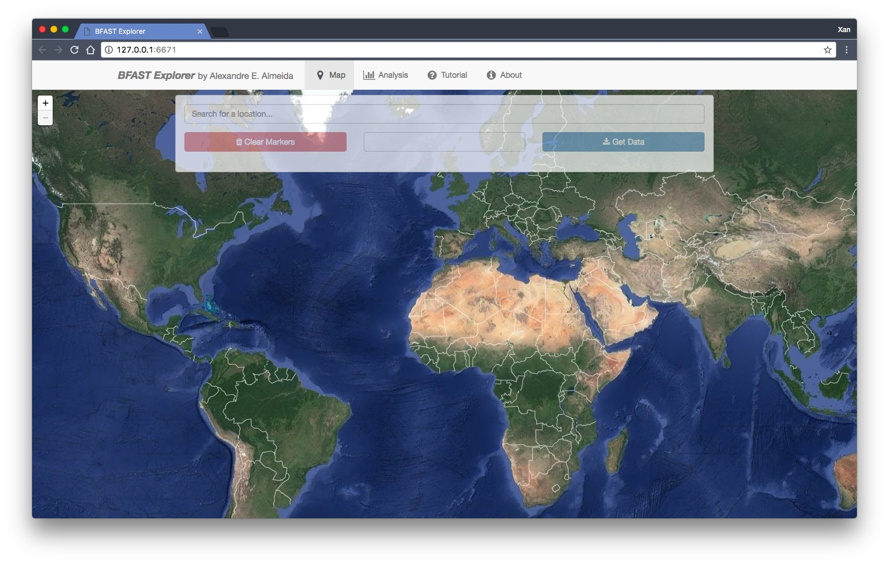

If we wish, we can also use the *search field* located on the top of the 
toolbar to search for a location. Then, the map 
automatically zooms to the desired location, similar to how Google Maps 
works. In the example, we searched for `unicamp campinas`, which is the
University of Campinas.

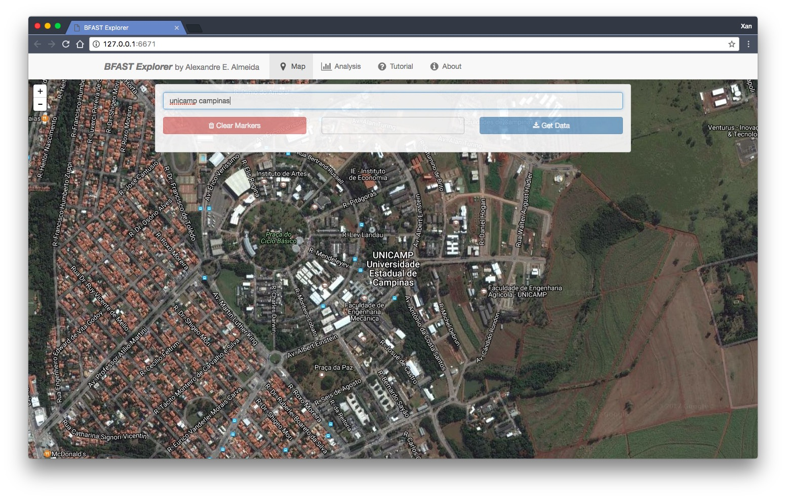

Now, let's zoom out all the way back and place a marker at the north of 
Brazil, as shown. To *place* a marker, simply click on the map. If we want
to, we can also place multiple markers.

We may also wish to clear all the placed markers. To do that, click on the
**[<i class="fa fa-trash"></i> Clear Markers]** red button on the left side
of the toolbar.

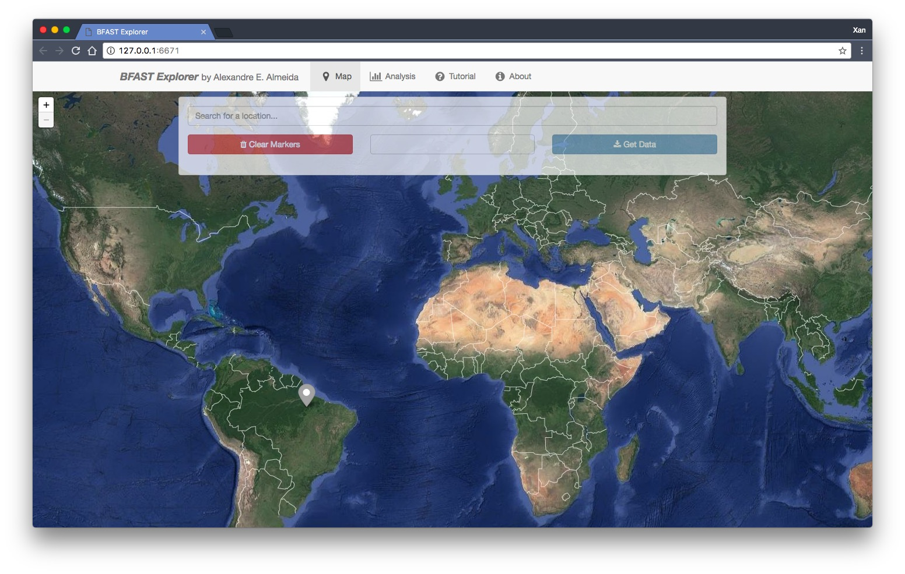

After that, we need to *select* one of the markers in order download its 
Landsat pixel data. To do that, simply click on an already placer marker, 
and it will be highlighted. Only one marker may be selected at a time.

By selecting a marker, we can now choose a combination of which satellites
to download from using the drop-down menu, located on the bottom of the 
toolbar. For instance, let's choose all the available satellites products:
Landsat 5, 7 and 8 SR.

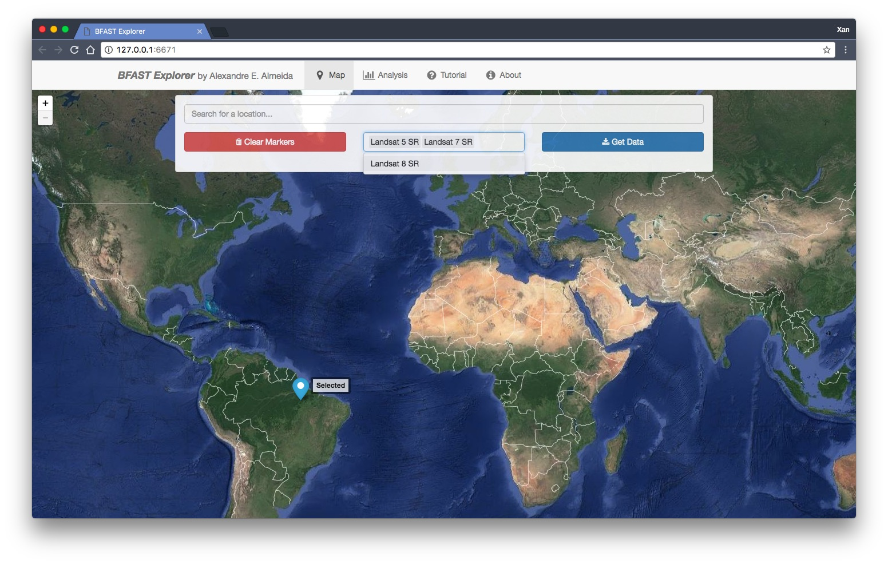

Then, we press the **[<i class="fa fa-download"></i> Get Data]** blue 
button, located on the right side of the toolbar. By pressing that button, 
the download will start. We can keep track of the download progress by 
looking to the lower right corner. All the historical data available are 
downloaded, which should take less than 10 seconds for the three products
selected.

<small> Note: as of the writing of this guide, not all Surface Reflectance
data are availble from GEE. So, depending on where we place our markers,
we may face a message indicating that *'No data available for the chosen* 
*satellite(s) and/or region... Please change your query and try again.'*. 
Since we rely heavily on GEE to download the data, there's nothing we can 
do yet. We're sorry for that. </small>

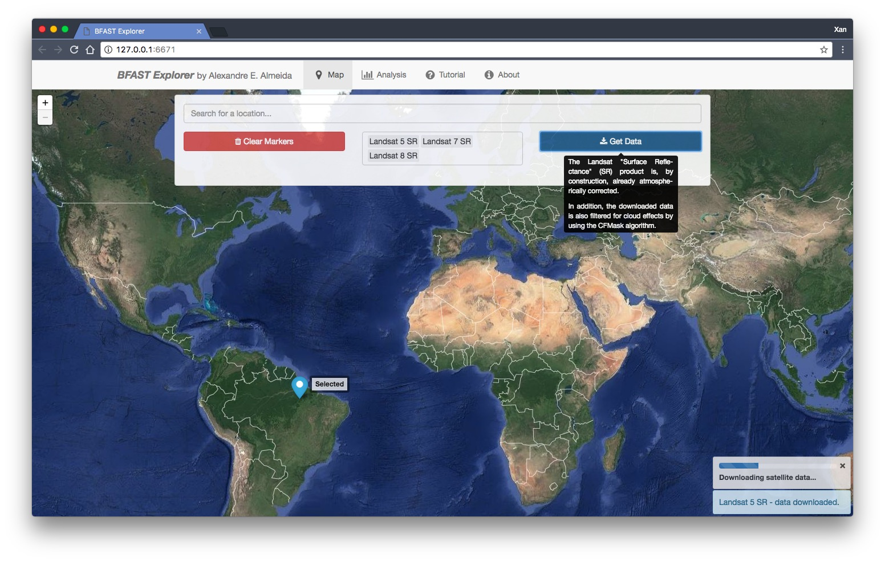

If the download is successful, we'll receive a message directing to the
**<i class='fa fa-bar-chart'></i> Analysis** tab.

### Analysis Tab <i class="fa fa-bar-chart"></i>

In this tab, we can analyze the downloaded data and, then,
locally save the results as files.

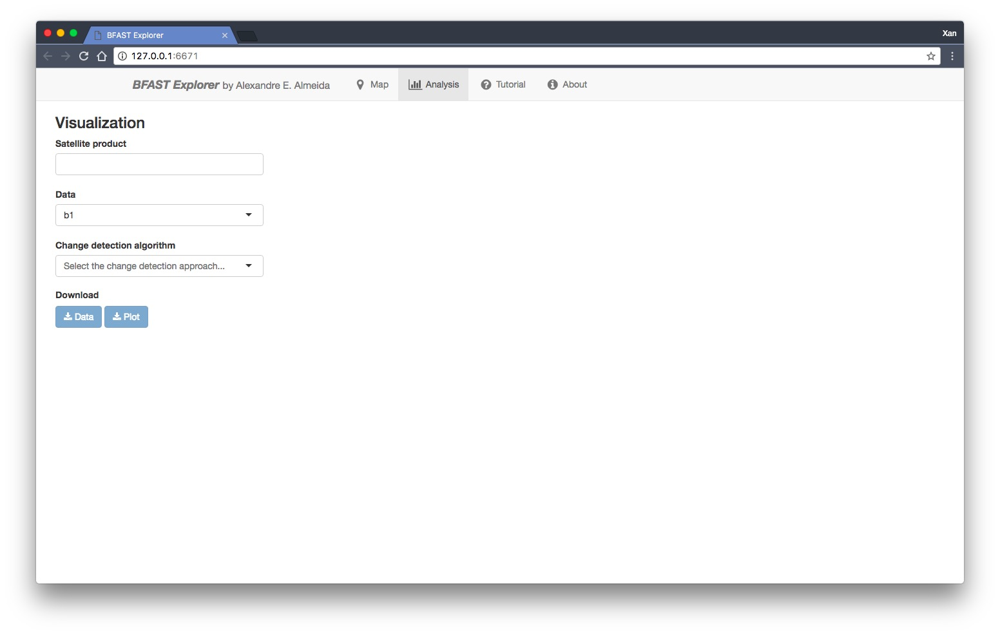

First, let's choose which satellite time series date to visualize. Note 
that, even though we downloaded data from Landsat 5, 7 and 8 SR, we're
can still analyze them separately. However, let's proceed by choosing
all of them.

As we can see, the time series of the first spectral band
(`b1`) is plotted for all satellites. A colored legend distinguishes the
different sources.

<small> Note: be careful when comparing *spectral bands* data from 
different satellites, as they may not correspond to the same wavelength range! Read more about this [here](https://landsat.usgs.gov/what-are-band-designations-landsat-satellites). </small>

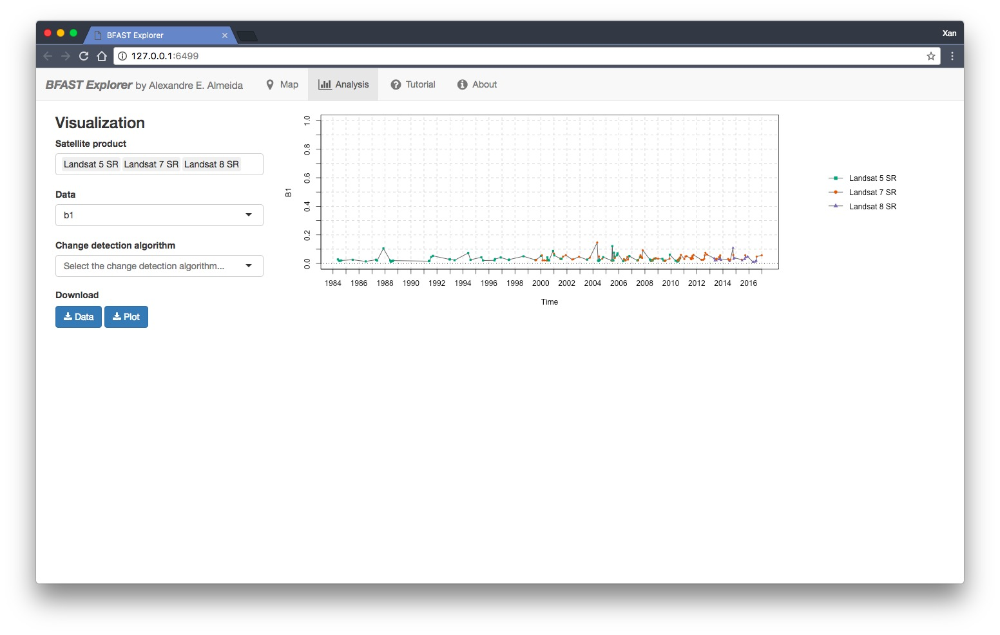

Apart from the spectral bands, there are also four spectral-bands-derived
indexes available: NDVI, NDMI, EVI and EVI2. Let's check, for example, the
NDVI time series.

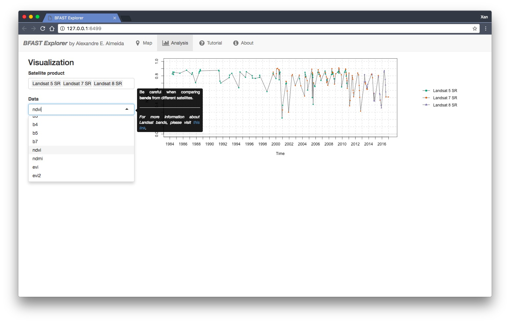

If we want to, we can also download *all* the time series data as a file.
To do that, press the **[<i class="fa fa-download"></i> Data]** blue
button. All the data will be downloaded as a .CSV, ordered by the acquisiton
date. Also, an additional column is included, in order to distinguish the
satellite sources.

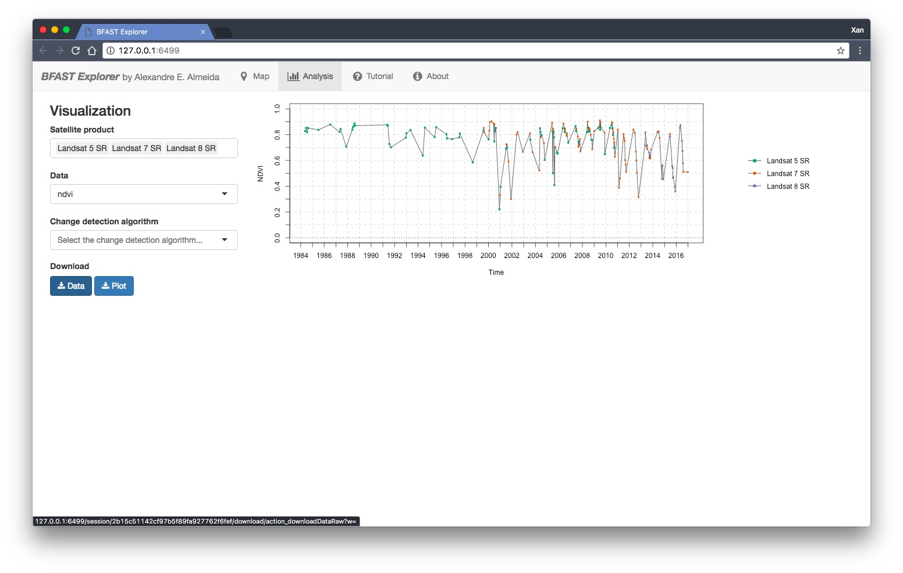

We may download the time series plot as an image, by pressing the
**[<i class="fa fa-download"></i> Plot]** blue button. A window will appear
offering some raster (.JPEG, .PNG) and a vectorial (.SVG) image output
formats.

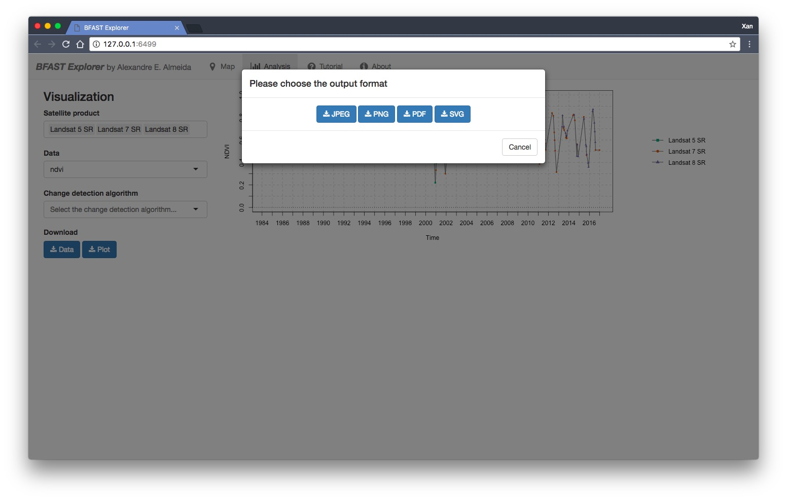

Next, we select the *change detection algorithm*. Three options are available: **bfastmonitor**, **bfast01** and **bfast**. More information
about these algorithms can be found [here](http://bfast.r-forge.r-project.org/).

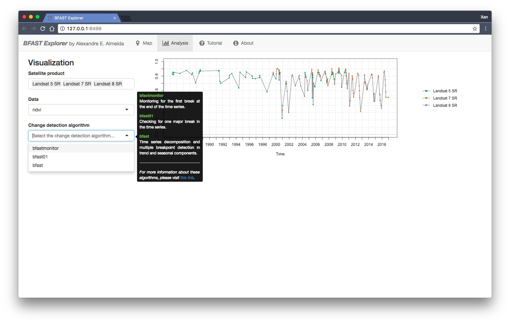

By selecting **bfastmonitor**, we are able to tweak four parameters on the
left side-bar: `formula`, `history period type`, `harmonic order`, and
`start of monitoring`. These parameters have different impacts on the
results, which can be verified on the right side plot. Here, we set the
maximum value of the `harmonic order` to 9 to avoid some problems.

Similar to the time series, we can also download the *results* of the change detection algorithms as .RDS data files, by clicking on the **[<i class="fa fa-download"></i> Results]** blue button. If we wish to download the plot, we can press the **[<i class="fa fa-download"></i> Plot]** blue button.

For more information on how to load .RDS files on R, please check this [link](http://www.fromthebottomoftheheap.net/2012/04/01/saving-and-loading-r-objects/).

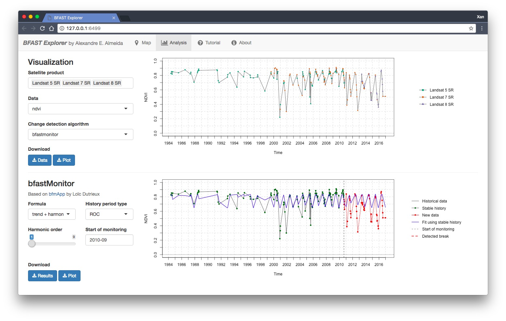

By selecting **bfast01**, we can tweak two parameters: `formula`, and `harmonic order`.
Here, the maximum value of the `harmonic order` is dynamically set 
depending on the time series data length and the choice of the `formula`
parameter.

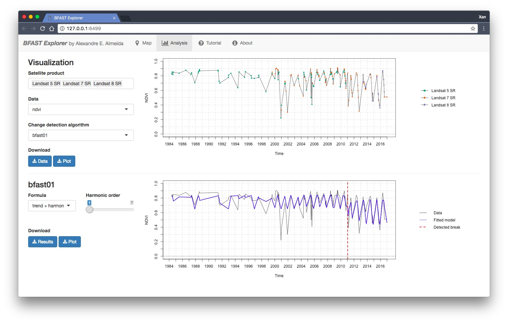

Finally, by selecting **bfast**, we may tweak two parameters: `h` (minimal
segment size), and `season type`. Please note that, since **bfast** can
detect multiple breakpoints, it may take a couple of seconds to process,
in comparison to the previous two algorithms.

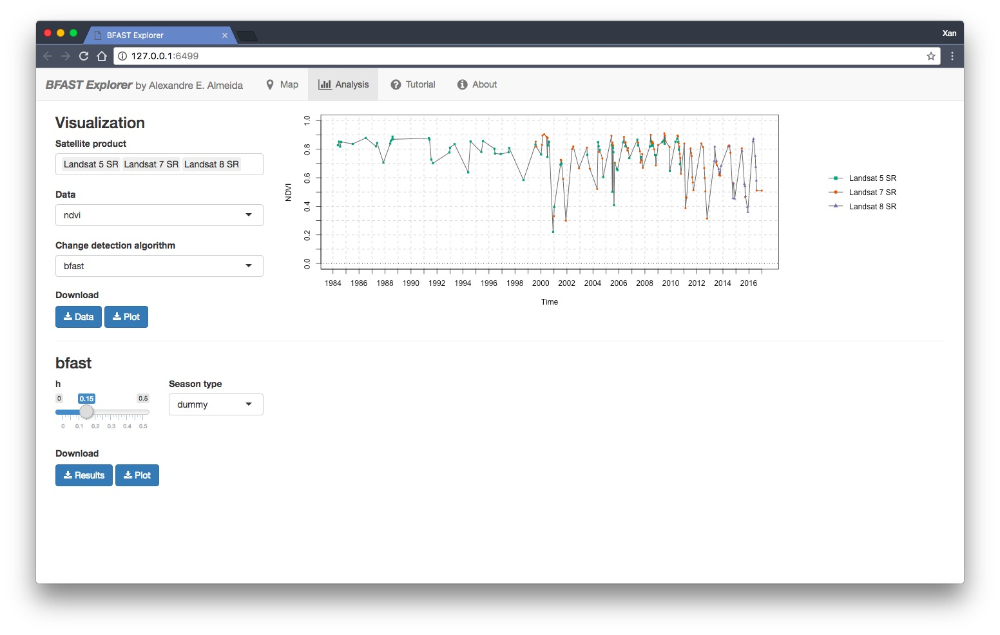
